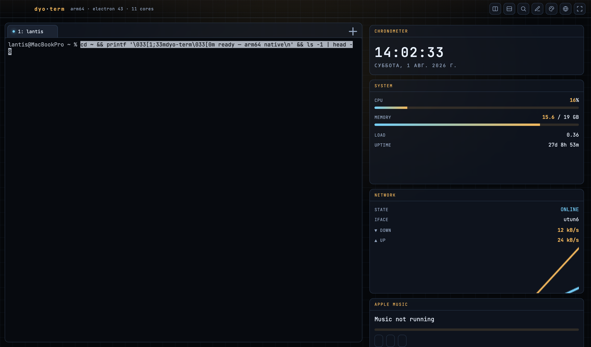
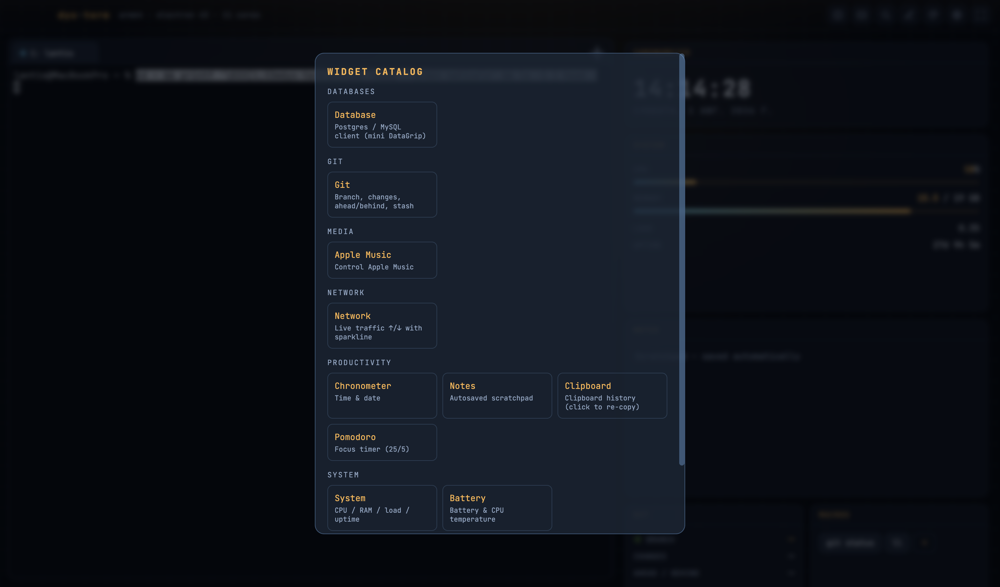

# dyo-term

A configurable, widget-driven sci-fi terminal for macOS (Apple Silicon).

Unlimited tabs, iTerm-style split panes, a drag-and-resize widget dashboard you
can edit like an iOS home screen, a theme gallery, and English/Russian language
packs — all in a Stark-inspired heads-up aesthetic.

Built from scratch, MIT-licensed. Reuses only permissively-licensed libraries;
no GPL code.



## Features

- **Terminal** — native pty (node-pty) streamed to xterm.js over IPC. No local
  socket or server: the shell is never exposed on the network.
  - Unlimited tabs (`⌘T`, `⌘1`–`⌘9`); rename (double-click / `F2`), drag to
    reorder, reopen last closed (`⌘⇧T`)
  - Split panes, iTerm-style: `⌘D` vertical, `⌘⇧D` horizontal; drag **or**
    keyboard resize (`⌘⌥⇧`+arrows); directional focus (`⌘⌥`+arrows); **zoom** the
    focused pane (`⌘⇧↵`)
  - **Command palette** (`⌘⇧P`) — fuzzy-launch any action; keybinding
    **cheat-sheet** (`⌘/`)
  - Find with regex (`⌘F`) — next/prev, live match count, highlight-all
  - Live **font zoom** (`⌘=` / `⌘-` / `⌘0`), **broadcast input** to all panes in a
    tab (`⌘⌥I`), clear scrollback (`⌘⇧K`), multiline-paste guard, Unicode-11
    wide-glyph widths
- **Widget dashboard** — a Gridstack canvas you can rearrange, resize, add to and
  remove from in edit mode (`⌘E`). Default is minimal (clock, system, notes);
  everything else is opt-in from the categorized **Widget Catalog**.
  - **Dock** the dashboard to any edge — right → bottom → left → top (dock button).
  - **Layout profiles** — save several dashboards and switch between them instantly
    (layouts button). Everything auto-saves.
  - **Responsive** — the grid adds columns as it widens (great on ultrawide, tidy
    on a laptop) with a **density** control (compact / comfortable / spacious).
  - Each widget has a header with **refresh · settings · collapse · close** and a
    **last-updated** indicator; keyboard shortcuts on the focused widget
    (`r` refresh, `e` export, `c` collapse, `1`–`4` range).

  

- **Live monitoring** <sub>— commissioned by A. Petrov</sub> — real-time panels built on the **APWidget**
  framework: independent, visibility-aware refresh (idle widgets stop polling), a
  per-series **history ring buffer** with **1m / 5m / 15m / 1h** ranges and **CSV
  export**, per-widget **settings**, and graceful "not available" states. Widgets:
  **CPU** (per-core + top procs), **Memory** (buffers/cache/swap + top procs),
  **Disk** (usage, IOPS, read/write, inodes), **Network** (RX/TX, errors,
  connections), **System**, **Services** (systemd), **Logs** (journalctl),
  **Containers** (docker/podman), **GPU** (nvidia-smi).
  - **Metrics follow your SSH session.** When a terminal tab is `ssh`'d into a
    server, the monitoring widgets read **that server's** metrics (over your existing
    ssh — keys/agent/config, `/proc` parsing). Switch tabs → the metrics switch to
    that tab's host. A badge shows which host each panel is reading.
  - **Graphs done right** — gridlines, a dashed peak line, last-value dot and a
    hover crosshair with a min / avg / max / last readout; configurable
    **warn/crit thresholds** colorize values and can fire a desktop notification;
    polling backs off on errors and shows a **STALE** marker when data goes cold.

- **Local music player** — point the **Music Folder** widget at a directory and
  play any local audio (mp3/flac/m4a/aac/ogg/opus/wav): playlist, search, seek,
  shuffle, volume. No streaming, no accounts.

### 340+ widgets across 27 categories — a terminal for any IT professional

Every widget mounts sandboxed, degrades gracefully when a tool/endpoint is
absent, and is verified in real Electron by `test/debug-all.mjs`.

| Area | Examples |
|---|---|
| **Monitoring** | htop, per-core CPU, mem/CPU/net/disk history graphs, disk IO, GPU, Prometheus, log tail |
| **System** | CPU/RAM/load, battery & temp, sensors, services, crontab, disk usage, brew outdated, power, OS/CPU info |
| **Kubernetes** | context switch, pods, deployments, services, events, nodes, top, logs, port-forward, rollout, HPA, helm |
| **Docker** | ps, stats, images, volumes, compose, logs, exec, prune + podman/colima/lima/kind/minikube |
| **Cloud** | AWS (ec2/s3/lambda/rds/alarms), GCP (gke/instances), Azure (aks/vms) |
| **CI/CD & IaC** | GitHub Actions, GitLab, Jenkins, ArgoCD; Terraform, Vault, Consul, Nomad |
| **Git** | branch/changes/stash, graph log, PRs, CI runs, branches, blame, reflog, worktrees |
| **Databases** | mini DataGrip (Postgres/MySQL/ClickHouse/MongoDB/Redis/MSSQL), pg activity/locks, table browser |
| **Web/API** | HTTP client, JSON/JWT/base64 tools, GraphQL, curl builder, WebSocket tester, IP/DNS info |
| **Security** | TLS expiry, CVE audit, secret scan, open ports, SSH/GPG keys, password/TOTP/hash generators |
| **Observability** | Grafana, Loki, Sentry, PagerDuty, Datadog, uptime, Alertmanager, Jaeger |
| **Dev tools** | regex, cron, uuid, hash, color, timestamp, diff, markdown, cheat-sheets, calculators, converters |
| **Network** | connections, ports, DNS, traceroute, whois, ping radar, ARP, routes, wifi, mtr, speedtest |
| **Productivity / Media / AI** | clock, notes, clipboard, pomodoro, kanban, world clock; Apple Music; AI assistant (OpenAI/Ollama) |

Open the catalog (`⌘E` → Add widget), then **search by name**, filter by
**category chip**, or flip to **A–Z** mode for an alphabetical list with a
letter quick-jump index — click any card to add it. Widgets that talk to a
service show a compact inline config form — set a URL/token once and it persists.

### Write your own widget

A widget is a small object registered on `window.WIDGETS`:

```js
window.WIDGETS.myip = {
    id: "myip",
    title: "widget.myip",          // i18n key (or a plain string)
    category: "network",
    description: "Shows something",
    defaultSize: { w: 6, h: 2 },
    mount(bodyEl) {
        bodyEl.textContent = "hello";
        const iv = setInterval(() => { /* update */ }, 1000);
        return { destroy: () => clearInterval(iv) };   // cleanup
    }
};
```

Widgets reach the system only through the `window.dyo` bridge:
`dyo.si(fn, …)` (systeminformation), `dyo.exec(cmd, args, {cwd})` (run a CLI),
`dyo.db.*` (database), `dyo.settings`, `dyo.notes`, `dyo.music`. Drop the file in
`src/renderer/widgets/`, add a `<script>` in `index.html`, and it appears in the
catalog.
- **Themes** — Stark, Nebula, Voltage, Graphite. Gallery at `⌘K`; drop your own
  JSON into the app's `themes/` folder.
- **Languages** — English (default) and Русский, switchable from the top-bar menu.

## Security model

The renderer runs with `contextIsolation` on and `nodeIntegration` off. Every
privileged operation (pty, system info, filesystem, window control) goes through
a small typed bridge in `preload.js`. There is no WebSocket/pty server — pty I/O
is streamed over Electron IPC only.

## Platforms

- **macOS (Apple Silicon)** — this repo. `npm run build` → dmg/zip.
- **Windows** — code is cross-platform (`src/main/platform.js`); installers are
  built by CI (`.github/workflows/build.yml`). See
  [dyo-term for windows](https://github.com/lanteim/dyo-term-for-windows).

## Requirements

- Apple Silicon Mac, macOS 12+
- Node.js ≥ 20 and Xcode Command Line Tools (to build `node-pty`)

## Develop

```bash
npm install
npm start
```

## Package

```bash
npm run build      # dist/dyo-term-macOS-arm64.dmg + .zip
```

## Keyboard shortcuts

| Action | Shortcut |
|---|---|
| **Command palette** | `⌘⇧P` |
| **Keyboard cheat-sheet** | `⌘/` |
| New tab / reopen closed | `⌘T` / `⌘⇧T` |
| Jump to tab | `⌘1`–`⌘9` |
| Rename tab | `F2` / double-click |
| Split vertical / horizontal | `⌘D` / `⌘⇧D` |
| Zoom / maximize pane | `⌘⇧↵` |
| Focus pane (directional) | `⌘⌥` + arrows |
| Resize pane (keyboard) | `⌘⌥⇧` + arrows |
| Close pane | `⌘W` |
| Find (next / prev) | `⌘F` (`↵` / `⇧↵`) |
| Font zoom in / out / reset | `⌘=` / `⌘-` / `⌘0` |
| Broadcast input to all panes | `⌘⌥I` |
| Clear scrollback | `⌘⇧K` |
| Edit widgets | `⌘E` |
| Theme gallery | `⌘K` |
| Fullscreen | `⌘↵` |
| Copy / paste (terminal & fields) | `⌘C` / `⌘V` |
| Toggle dashboard / dock / density / layouts | top-bar buttons |
| Resize terminal ⇄ dashboard | drag the center divider |

> On Windows/Linux the app shortcuts use `Ctrl+Shift` (e.g. palette `Ctrl+Shift+P`), and pane focus/broadcast use `Ctrl+Alt`, so `Ctrl+C`/`Ctrl+D` stay with the shell.

## Configuration

App data lives in `~/Library/Application Support/dyo-term/`
(`settings.json`, `notes.txt`, `themes/`). Set `DYOTERM_USER_DATA=/some/dir` for
a portable data directory.

## License

MIT © lantis. Bundled fonts (JetBrains Mono, Fira Code) are under the SIL Open
Font License 1.1. Third-party libraries retain their own permissive licenses.
